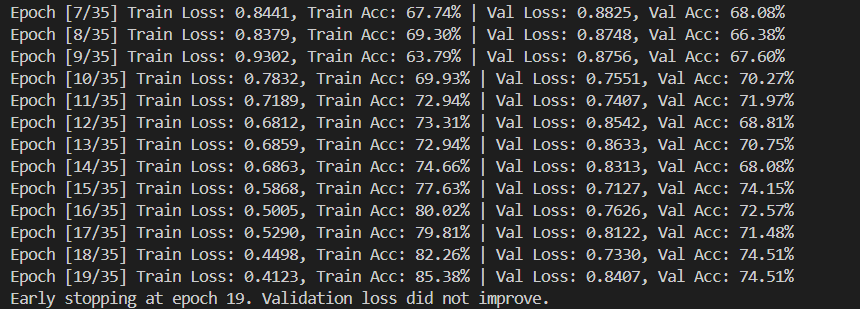
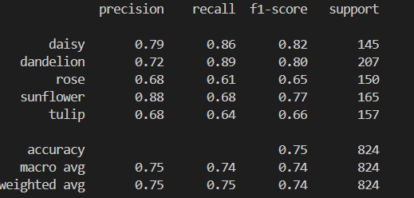
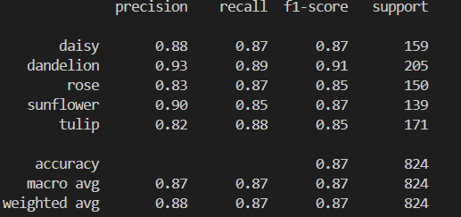
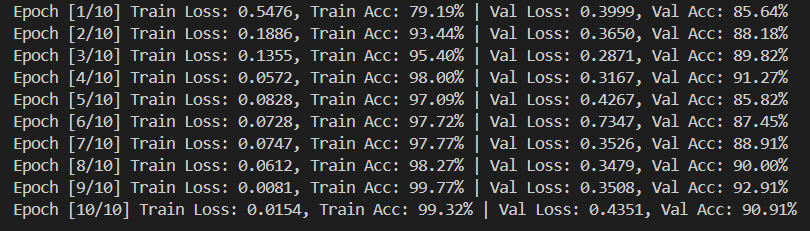
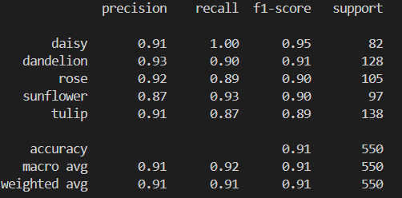
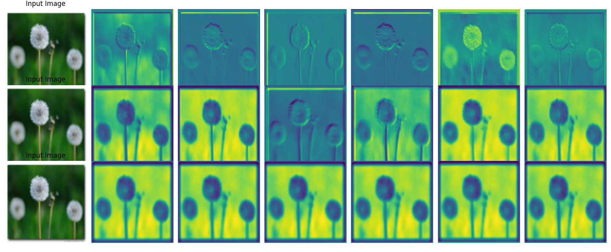
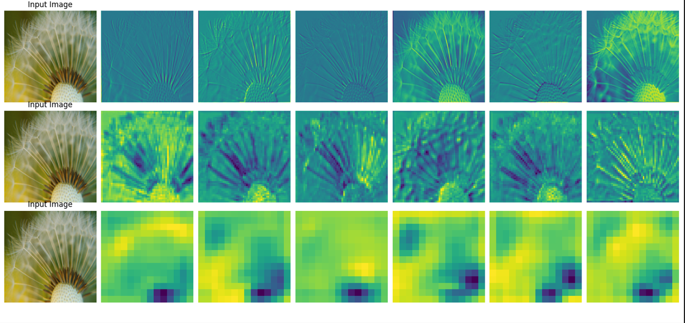
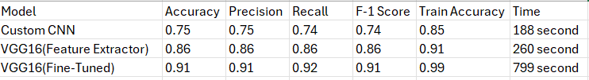

# SE-3508-Introduction-to-Artificial-Intelligence

This project was completed as part of the SE3508 Introduction to Artificial Intelligence course,
instructed by Dr. Selim Yılmaz, Department of Software Engineering at Muğla Sıtkı Koçman University, 2025.

You can access saved models here : https://drive.google.com/drive/folders/1IE106tw0q5qunMsAZtm0xWPPrUHE5l18?usp=sharing

# Flower Classification with CNN and VGG16 Models
In this project, three different models were trained and compared to classify flower species using the Kaggle Flowers dataset:
Dataset : https://www.kaggle.com/datasets/imsparsh/flowers-dataset
Model #1: Custom CNN 
Model #2: VGG16 - Feature Extractor
Model #3: VGG16 - Fine-Tuning

## Model #1 - Custom CNN
In this model, a custom-designed CNN architecture was used. To prevent overfitting, various techniques were applied:

Dropout rates were gradually increased in each layer (from 0.1 to 0.5),

EarlyStopping was implemented to prevent overtraining.

The model was intended to be trained for 35 epochs; however, training was stopped early at epoch 20 when the validation loss plateaued. During training, the model’s training accuracy nearly reached 100%, but early stopping effectively prevented overfitting.

Data augmentation was considered as an alternative but was not used because it significantly increased training time without substantially improving results.

### Performance Evaluation
Training and validation accuracies were tracked at the end of each epoch.

Using classification_report, precision, recall, and F1-score were measured for each class.

### Feature Visualization
To better understand the internal workings of the model, activation maps of the first, third, and fifth layers were extracted, inspired by the paper "Visualizing and Understanding Convolutional Networks."

The process involved:

Selecting a sample image from the training dataset,

Visualizing the activations obtained after passing through the selected layers,

Observing which features the model extracts from the image.

## Model #2 - VGG16 - Feature Extractor
In this model, as specified in the assignment PDF, all layers of the VGG16 model have been frozen. 

The final fully connected (FC) layer has been replaced with a 5-class classifier according to our flower dataset. 

The model was trained only to fine-tune the final classifier layer. Below are the training process and the results obtained.

### Performance Evaluation
Training and validation accuracies were tracked at the end of each epoch.

Using classification_report, precision, recall, and F1-score were measured for each class.

## Model #3 - VGG16 - Fine-Tuning

In this section, as specified in the assignment, I froze the first 5 layers and fine-tuned the classifier part. I also tried to visualize the features based on my understanding of the paper mentioned above. 

Additionally, I learned that in VGG, the 0th layer corresponds to the 1st block, the 10th layer corresponds to the 3rd block, and the 28th layer corresponds to the 5th block. 

I made the visualizations according to these layers because we were asked to visualize the following: 1st conv layer, Middle conv layer, and Deepest conv layer.

### Performance Evaluation
Training and validation accuracies were tracked at the end of each epoch.

Using classification_report, precision, recall, and F1-score were measured for each class.

# Visualizations

### Model #1 - Custom CNN 

### Model #3 - VGG16 - Fine-Tuning

# Results

**INFO:**  Custom CNN model shows the lowest performance with 75% accuracy. Although the training time is short, the test performance is low. Also, the difference between training and test accuracy indicates the possibility of overfitting. I tried many things to prevent this.
Fine-tuned VGG16 model showed the highest performance with 92% accuracy and 0.97% training accuracy. The training time is long but the results are quite successful. This model has the best generalization ability on the dataset. VGG16 (Feature Extractor) model offers balanced performance in terms of training time and accuracy.